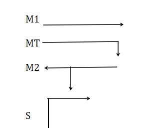
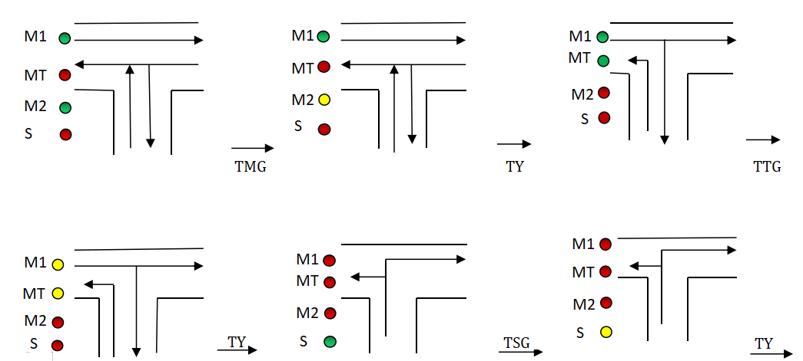
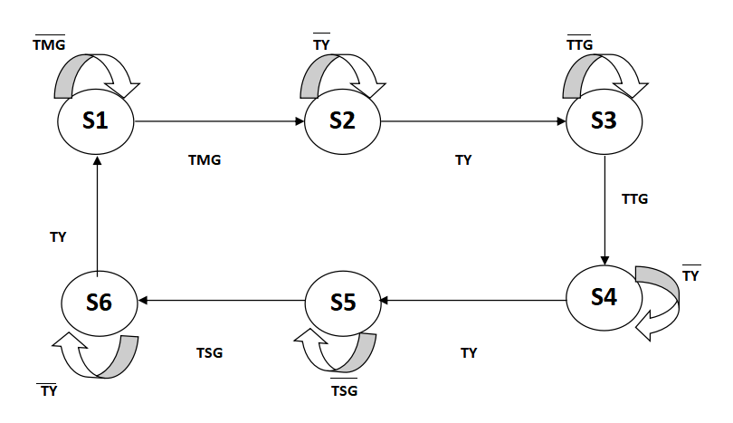
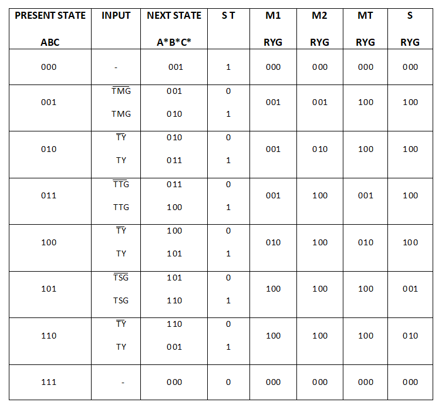
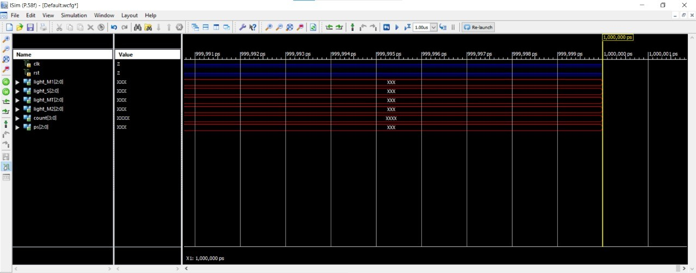
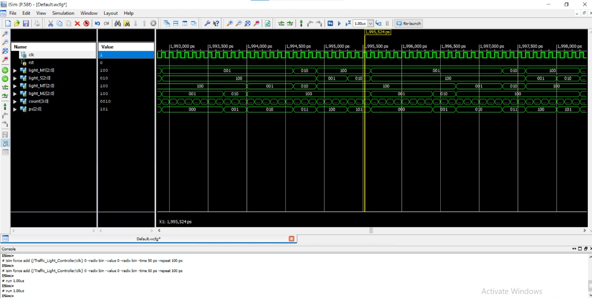
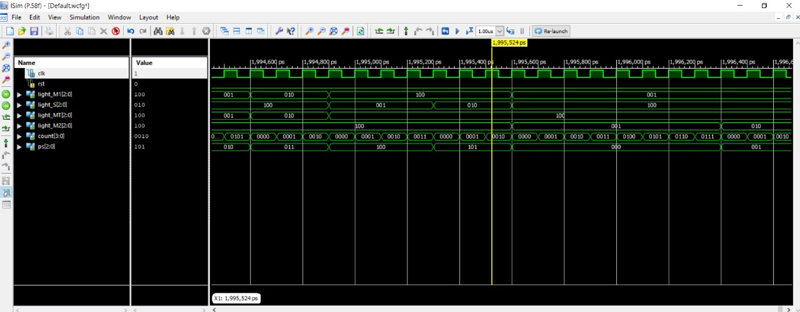

# Traffic Light Controller Using Verilog

_This project aims to design a traffic control system using Verilog HDL with specific time delays for a T-shaped road intersection._

# Table of Contents

1. [Introduction](#Introduction)
2. [Methodology](#Methodology)
   - [Directions Considered](#directions-considered)
   - [Problem Statement](#problem-statement)
   - [State Diagram](#state-diagram)
   - [State Table](#state-table)
3. [RTL Code](#rtl-code)
   - [RTL Schematic View](#rtl-schematic-view)
4. [TESTBENCH](#testbench)
5. [Output Waveforms](#output-waveforms)
6. [Result](#result)
7. [Future work](#future-work)
8. [References](#references)
9. [Author](#author)

## Introduction

Traffic control is a significant challenge in urban areas due to increasing vehicle density and the dynamic nature of traffic patterns. Inefficient traffic management often results in congestion, accidents, and wasted time. This project proposes a Verilog HDL-based approach to streamline traffic flow and reduce waiting time at signals, specifically for a T-junction.

Verilog is a hardware description language (HDL) used to model electronic systems. Traditional circuit prototyping using breadboards or PCBs can be time-consuming and error-prone due to manual wiring and component limitations. HDL like Verilog allows designers to model, simulate, and verify complex digital circuits efficiently before actual hardware implementation.

HDL is extensively used in both sequential designs (like shift registers) and combinational circuits (such as adders or multiplexers). Its ability to describe entire digital systems—including processors and memory architectures—makes it indispensable in modern design workflows. Compared to manual circuit assembly, HDL-based approaches offer faster simulation, easier debugging, and better scalability for larger designs.

This project models a simple T-intersection traffic light control system using Verilog HDL. The design was tested and simulated using Xilinx ISE 14.5.

Traffic lights are electronic devices used to assign the right of way at road intersections and pedestrian crossings, typically using the standard red, yellow, and green signals. They also work in coordination with pedestrian indicators to manage crossing rights.

In current systems:

1. A red light indicates vehicles must stop.
2. A yellow light signals drivers to slow down and prepare to stop.
3. A green light allows vehicles to move forward.

Common traffic issues like unnecessary waiting or improper jam handling arise due to fixed timing regardless of traffic density. These problems often require manual intervention by traffic personnel. This project addresses such challenges by proposing a cost-effective traffic light controller.

Traffic light controllers can be implemented using microcontrollers, ASICs, or FPGAs. FPGAs offer advantages like higher speed, greater I/O capacity, and real-time performance, while being more cost-efficient than ASICs. Their reconfigurable nature also enables fast prototyping and post-deployment updates.

Most traffic light systems implemented on FPGAs utilize Finite State Machines (FSM) for control logic due to their simplicity and reliability in real-time scenarios.

#### Why Verilog?

Verilog HDL was chosen for this project as it effectively serves two critical needs:

- It allows designers to clearly define the structural hierarchy of a system and how components are interconnected.
- It enables pre-fabrication simulation, allowing developers to test and compare multiple design iterations without incurring manufacturing delays or costs.

#### Advantages of Verilog HDL:

Verilog is a widely adopted HDL for digital system design and is also capable of modeling analog and mixed-signal behavior. It helps in defining relationships between various signals and modules in a hardware system.

A Verilog model describes digital hardware in terms of:

- Interconnections between hardware modules whose behavior is defined for simulation.
- Procedural or behavioral descriptions that abstract I/O behavior of the intended hardware system.

There are two major HDLs: Verilog and VHDL (VHSIC Hardware Description Language). Each has its pros and cons, but Verilog is preferred in this project due to its suitability for:

- Synthesizable logic circuit design,
- Circuit verification (both analog and digital),
- Combining synthesis and behavior modeling,
- Netlist-level structural representation.

#### Benefits of Verilog HDL:

- Simple and concise syntax.
- Intuitive to understand for those familiar with C-style programming.
- Easier to learn and use compared to VHDL.

## 🛠️ Languages & Tools Used

- **Verilog HDL** – Hardware description language used to design the traffic controller.
- **Xilinx ISE 14.5** – For simulation and synthesis.

## Methodology

### Directions Considered



The directions, M1, MT, M2, S, that is been considered for analysis of our problem is shown in the figure. And, the problem statement is explained in the figure.
Six states, S1, S2, S3, S4, S5, S6 are taken into consideration and state diagram, state table is made using the following logic explained in the figure.

### Problem Statement



- Green light indicates that there is no traffic and there is easy flow of vehicles in that route/direction.
- Red light indicates that there is a traffic jam and that route is blocked for the vehicles to move and,
- Yellow light indicates that the route has medium flow of vehicles.

Time delays for changing from one state to another is considered as, TMG(from S1 to S2), TY(from S2 to S3), TTG(from S3 to S4), TY(from S4 to S5), TSG(from S5 to S6)
and TY(from S6 to S1) and the cycle continues.

### State Diagram



In Figure, The time delays are considered as follows :

- TMG = 7 seconds
- TY = 2 seconds
- TTG = 5 seconds
- TSG = 3 seconds

Until TMG seconds, the signal will remain in S1 state, and after TMG seconds, it will move to S2 state. Until TY seconds it will remain in S2 state and after TY seconds,
it will move to S3 state, and so on. After TY seconds, in state S6, it will go back to S1 state and the cycle continues.

### State Table



In Figure,

- R = RED,
- Y = YELLOW and,
- G = GREEN.

ST = State Transition; A, B and C are considered as the present state.
The state table is made, considering the Logic diagram/problem statement given in Figure.
From the Figure it is understood that,

In state S1(001);

```
     1. M1 = GREEN, implies, RYG value = 001,
     2. MT = RED, implies, RYG value = 100,
     3. M2 = GREEN, implies, RYG value = 001 and,
     4. S = RED, implies, RYG value = 100.

```

After TMG seconds,

In state S2(010);

```
      1. M1 = GREEN, implies, RYG value = 001,
      2. MT = RED, implies, RYG value = 100,
      3. M2 = YELLOW, implies, RYG value = 010 and,
      4. S = RED, implies, RYG value = 100.

```

After TY seconds,

In state S3(011);

```
      1. M1 = GREEN, implies, RYG value = 001,
      2. MT = GREEN, implies, RYG value = 001,
      3. M2 = RED, implies, RYG value = 100 and,
      4. S = RED, implies, RYG value = 100.

```

After TTG seconds,

In state S4(100);

```
      1. M1 = YELLOW, implies, RYG value = 010,
      2. MT = YELLOW, implies, RYG value = 010,
      3. M2 = RED, implies, RYG value = 100 and,
      4. S = RED, implies, RYG value = 100.

```

After TY seconds,

In state S5(101);

```
      1. M1 = RED, implies, RYG value = 100,
      2. MT = RED, implies, RYG value = 100,
      3. M2 = RED, implies, RYG value = 100 and,
      4. S = GREEN, implies, RYG value = 001.

```

After TSG seconds,

In state S6(110);

```
       1. M1 = RED, implies, RYG value = 100,
       2. MT = RED, implies, RYG value = 100,
       3. M2 = RED, implies, RYG value = 100 and,
       4. S = YELLOW, implies, RYG value = 010.

```

And after S6 state, the cycle repeats and goes to S1 state.

## RTL Code

```

`timescale 1ns / 1ps
module Traffic_Light_Controller(
    input clk,rst,
    output reg [2:0]light_M1,
    output reg [2:0]light_S,
    output reg [2:0]light_MT,
    output reg [2:0]light_M2
	 );

    parameter  S1=0, S2=1, S3 =2, S4=3, S5=4,S6=5;
    reg [3:0]count;
    reg[2:0] ps;
    parameter  sec7=7,sec5=5,sec2=2,sec3=3;

    always@(posedge clk or posedge rst)
        begin
        if(rst==1)
        begin
        ps<=S1;
        count<=0;
        end
        else
            case(ps)
                S1: if(count<sec7)
                        begin
                        ps<=S1;
                        count<=count+1;
                        end
                    else
                        begin
                        ps<=S2;
                        count<=0;
                        end
                S2: if(count<sec2)
                        begin
                        ps<=S2;
                        count<=count+1;
                        end
                    else
                        begin
                        ps<=S3;
                        count<=0;
                        end
              S3: if(count<sec5)
                        begin
                        ps<=S3;
                        count<=count+1;
                        end
                    else
                        begin
                        ps<=S4;
                        count<=0;
                        end
                S4:if(count<sec2)
                        begin
                        ps<=S4;
                        count<=count+1;
                        end
                    else
                        begin
                        ps<=S5;
                        count<=0;
                        end
                S5:if(count<sec3)
                        begin
                        ps<=S5;
                        count<=count+1;
                        end
                    else
                        begin
                        ps<=S6;
                        count<=0;
                        end
                S6:if(count<sec2)
                        begin
                        ps<=S6;
                        count<=count+1;
                        end
                    else
                        begin
                        ps<=S1;
                        count<=0;
                        end
                default: ps<=S1;
                endcase
            end

            always@(ps)
            begin
           case(ps)
                    S1:
                    begin
                       light_M1<=3'b001;
                       light_M2<=3'b001;
                       light_MT<=3'b100;
                       light_S<=3'b100;
                    end
                    S2:
                    begin
                       light_M1<=3'b001;
                       light_M2<=3'b010;
                       light_MT<=3'b100;
                       light_S<=3'b100;
                    end
                    S3:
                    begin
                       light_M1<=3'b001;
                       light_M2<=3'b100;
                       light_MT<=3'b001;
                       light_S<=3'b100;
                    end
                    S4:
                    begin
                       light_M1<=3'b010;
                       light_M2<=3'b100;
                       light_MT<=3'b010;
                       light_S<=3'b100;
                    end
                    S5:
                    begin
                       light_M1<=3'b100;
                       light_M2<=3'b100;
                       light_MT<=3'b100;
                       light_S<=3'b001;
                    end
                    S6:
                    begin
                       light_M1<=3'b100;
                       light_M2<=3'b100;
                       light_MT<=3'b100;
                       light_S<=3'b010;
                    end
  default:
                    begin
                       light_M1<=3'b000;
                       light_M2<=3'b000;
                       light_MT<=3'b000;
                       light_S<=3'b000;
                    end
                  endcase
            end
endmodule


```

### RTL Schematic View


## TESTBENCH

```

`timescale 1ns / 1ps
module Traffic_Light_Controller_TB;
reg clk,rst;
wire [2:0]light_M1;
wire [2:0]light_S;
wire [2:0]light_MT;
wire [2:0]light_M2;
wire [3:0] count;
wire [2:0]ps;
Traffic_Light_Controller dut(.clk(clk) , .rst(rst) , .light_M1(light_M1) , .light_S(light_S)  ,.light_M2(light_M2),.light_MT(light_MT)  );
initial
begin
    clk=1'b0;
    forever #(1000000000/2) clk=~clk;
end

initial
begin
    rst=0;
    #1000000000;
    rst=1;
    #1000000000;
    rst=0;
    #(1000000000*200);
    $finish;
end
endmodule

```

## Output Waveforms







## Result

This model simulates multiple states that determine the signal behavior at a T-shaped intersection. For example, in the initial stage, the signal at the north-south direction is red, while the east-west direction receives a green signal, allowing vehicles to pass. After a preset delay, a yellow signal is activated for east-west, followed by red, while the north-south direction transitions to green. This cycle repeats continuously.

Modern traffic management systems significantly improve flow by sensing traffic levels and adjusting timings accordingly. In this project, Verilog HDL was used to describe the circuit, and the design was successfully simulated using Xilinx ISE 14.5.

This system uses fixed-time allocation for each direction, which remains constant regardless of changing traffic density. In real-world scenarios, a heavier traffic flow in one direction might require longer green light durations than currently allotted.

Nevertheless, this type of traffic controller helps ensure an orderly and safe movement of vehicles. Many areas, especially smaller towns, still lack reliable traffic signal systems—often leading to avoidable congestion and accidents. Hence, such systems can play a vital role in enhancing traffic control and road safety.

## Future Work

This design can be extended to support intelligent control based on real-time traffic density using sensors like IR transceivers. It could also incorporate an auto-off mechanism for idle roads, contributing to power efficiency.

Future improvements could include solar-powered operation for energy independence, and integration with GPRS or GPS mapping systems to help prioritize routes for emergency and law enforcement vehicles. On a broader scale, the design can be expanded to manage 4-way and 8-way junctions, such as those found on national highways.

## References

1. Laboratory Exercise #12, The Traffic Light Controller Lab. “ECEN 248: Introduction to Digital Design”. Department of Electrical and Computer Engineering, Texas A&M University.

2. Rajeev Madhavan, _Verilog HDL Reference Guide_, Automata Publishing Company, CA, 1993. ISBN 0-9627488-4-6

3. E. Sternheim, Rajvir Singh, Rajeev Madhavan, Yatin Trivedi, _Digital Design and Synthesis with Verilog HDL_, Automata Publishing Company, CA, 1993. ISBN 0-9627488-2-X

4. https://intentswell.blogspot.com/2021/03/traffic-light-controller-project-report.html

5. https://www.semanticscholar.org/paper/An-Advanced-Traffic-Light-Controller-using-Verilog-B.-ala/1ca8a8e50c2c8273a3ee1247a6057f8eb4f402ee

6. https://www.academia.edu/21200096/DESIGN_AND_IMPLEMENTATION_OF_TRAFFIC_LIGHTS_CONTROLLER_USING_FPGA_A_Project_Based_Laboratory_Report_in_partial_fulfilment_for_the_award_of_III_IV_B_Tech_I_Semester_Submitted_by_Lab_Instructor

7. https://vlsicoding.blogspot.com/2013/11/verilog-code-for-traffic-light-control.html

8. https://www.fpga4student.com/2016/11/verilog-code-for-traffic-light-system.html

9. https://www.slideshare.net/UtkarshDe/four-way-traffic-light-conrol-using-verilog


## License
📄 This project is licensed under the MIT License – see the [LICENSE](LICENSE) file for details.

For any further queries, feel free to reach out:

📧 Email: [anshuman.mondal@iitg.ac.in](mailto:anshuman.mondal@iitg.ac.in)  
🔗 LinkedIn: [Connect on LinkedIn](https://www.linkedin.com/in/anshuman-mondal-145314280)
